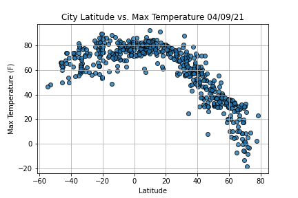

# World_Weather_Analysis

  

(swap out image for heatmap)

## Table of Contents
* [Overview](https://github.com/rkaysen63/World_Weather_Analysis/blob/master/README.md#overview)
* [Resources](https://github.com/rkaysen63/World_Weather_Analysis/master/README.md#resources)
* [Results](https://github.com/rkaysen63/World_Weather_Analysis/master/README.md#results)

## Overview:
"PlanMyTrip", is an online travel app that helps customers locate lodging anywhere in the world.  They want to improve their user interface by allowing customers to define their preferred temperature range, in order to generate map of hotels around the world that meet their criteria.  The map will have interactive markers that will allow the customer to select and view the following information: hotel, city, country, weather description and maximum temperature. 

## Resources

* APIs:
  * https://cloud.google.com/maps-platform
  * https://openweathermap.org/api
* Software: Python 3.7.9 in Jupyter Notebook interface
* Lesson Plan: UTA-VIRT-DATA-PT-02-2021-U-B-TTH, Module 6 Challenge

## Results:
### Retrieve Weather Data
* Cities throughout the world were selected at random.  
  * The `numpy` dependency was imported and random latitude, longitude pairs were created using `numpy.random`.  

    import numpy as np  
        lats = np.random.uniform(low=-90.000, high=90.000, size=2000)  
        lngs = np.random.uniform(low=-180.000, high=180.000, size=2000)  
        lat_lngs = zip(lats, lngs)
        coordinates = list(lat_lngs) 
        
  * The `citipy` module was imported in order create a list of cities based on the latitude, longitude pairs.

        cities = []  
        for coordinate in coordinates:  
            city = citipy.nearest_city(coordinate[0], coordinate[1]).city_name  
            if city not in cities:  
                cities.append(city)

  * Then iterate through the list of cities and make an API request for each city to gather weather data.

        import requests
        from config import weather_api_key
        url = "http://api.openweathermap.org/data/2.5/weather?units=Imperial&APPID=" + weather_api_key
        
        city_data = []
        record_count = 1
        set_count = 1
        
        for i, city in enumerate(cities):
            if (i % 50 == 0 and i >= 50):
                set_count += 1
                record_count = 1
                
            city_url = url + "&q=" + city.replace(" ","+")
            print(f"Processing Record {record_count} of Set {set_count} | {city}")
            record_count += 1
            try:
                city_weather = requests.get(city_url).json()
                    city_lat = city_weather["coord"]["lat"]
                    city_lng = city_weather["coord"]["lon"]
                    city_max_temp = city_weather["main"]["temp_max"]
                    city_humidity = city_weather["main"]["humidity"]
                    city_clouds = city_weather["clouds"]["all"]
                    city_wind = city_weather["wind"]["speed"]
                    city_country = city_weather["sys"]["country"]
                    city_weather_description = city_weather["weather"][0]["description"]
                    
                    city_data.append({"City": city.title(),
                          "Country": city_country,
                          "Lat": city_lat,
                          "Lng": city_lng,
                          "Max Temp": city_max_temp,
                          "Humidity": city_humidity,
                          "Cloudiness": city_clouds,
                          "Wind Speed": city_wind,
                          "Current Description": city_weather_description})
            except:
                print("City not found. Skipping...")
                pass

* Create a DataFrame and export to a file (CSV).  
  * Convert the array of dictionaries to a Pandas DataFrame.

        import pandas as pd
        city_data_df = pd.DataFrame(city_data)

(insert image of city_data_df)

### Create A Customer Travel Destinations Map
### Create a Customer Travel Itinerary Map

[Back to the Table of Contents](https://github.com/rkaysen63/World_Weather_Analysis/blob/master/README.md#table-of-contents)
